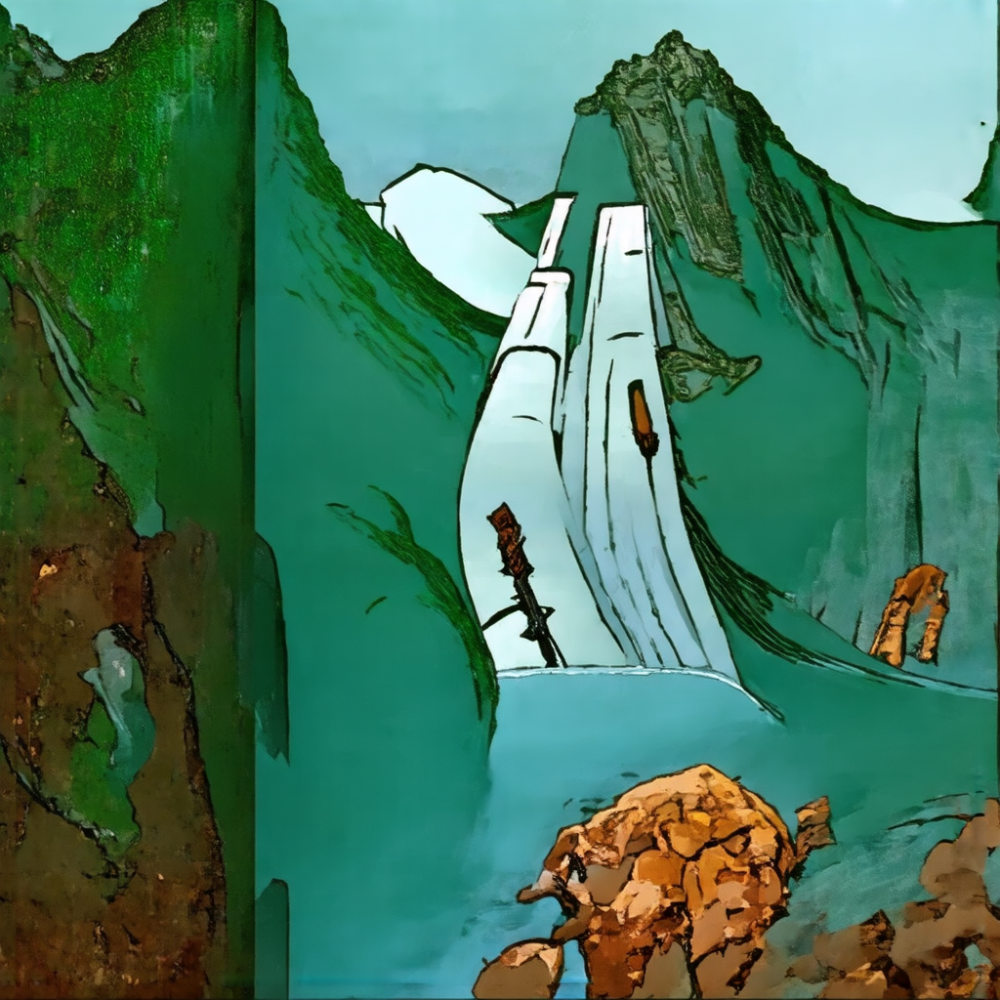

# Vintage Chinese Cartoon Stable Diffusion fine-tuning

## About

Stable Diffusion 3 Medium fine-tuned on a classic Chinese cartoon "Havoc in Heaven".
The film looks like this:

## Benchmarking
* scraper for images on RealPython
    * serial download: `Time elapsed: 57.5342 seconds`

## Implementation
* steps taken to address overfitting

## Things worthnoting
* captioning might need to specify the exact style (cartoon)
* training data size for lora vs normal
* training data qc
* hyperparams
    * training: learning rate, training steps 
    * inferencing: scheduler, step numbers
* log model history
* in training loop, loss can hit 0.5